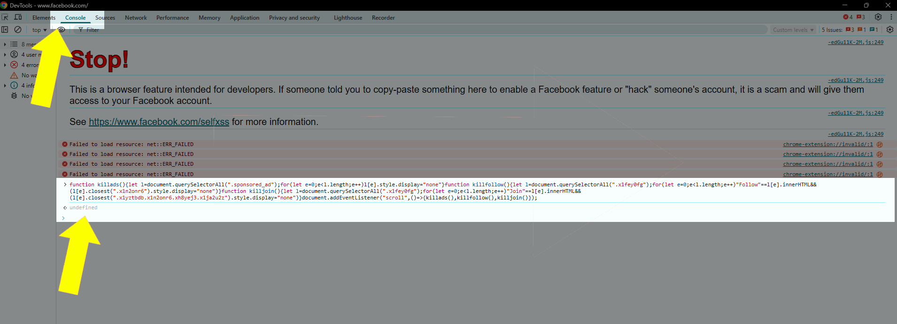

# Facebook-Add-Hack
A simple one-liner to remove Facebook ads and garbage.
Only tested in Chrome.

I haven't used FB in years and recently started again. I missed most of my friends back home's posts between all the garbage so, I threw this together.
Took me like 5 minutes and it might not work in a few months or a year but, then I'll just change it accordingly.

1. Copy the code from [app.js](app.js)
2. In Chrome right-click and pick "Inspect".
3. Click the "Console" tab.
4. Ignore the warning ( this isn't going to hurt anything except maybe Zuck's bottom-line ... yeah right :smirk: )
5. Paste the code
6. Enjoy!

 
 
# Versions

## 📅 March 23, 2025
## ⬆️📅 June 6, 2025

* ## 1.0.0.2
*   🐱 hiding Join sections removes more garbage and it appears to be a smoother experience
* ## 1.0.0.1
*   🐞 hiding sections versus killing them produces a better navigation experience 
* ## 1.0.0.0
